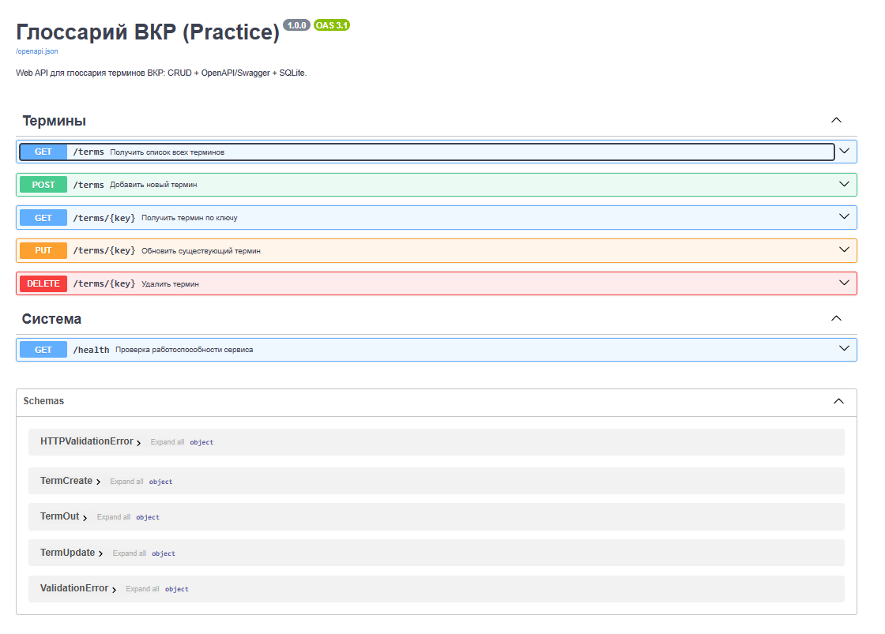
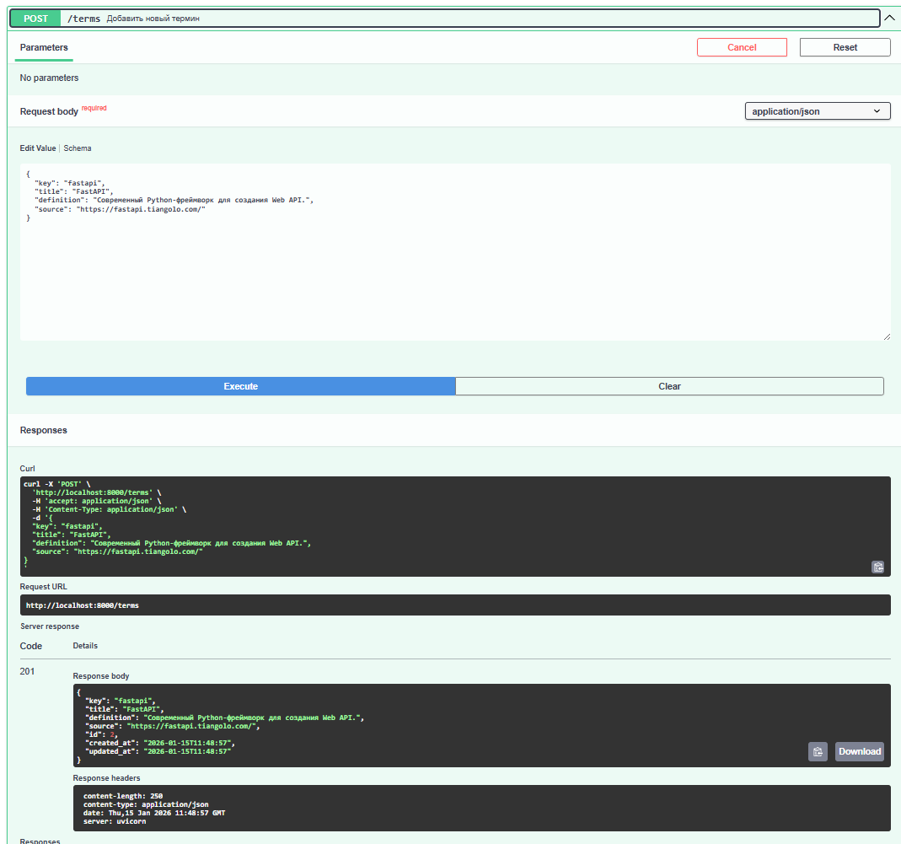

# Глоссарий терминов ВКР - Web API (FastAPI + SQLite + Docker)

Это учебный проект для практики: **«Создание и контейнеризация глоссария терминов ВКР»**.  
Сервис реализует CRUD-операции над терминами и автоматически публикует OpenAPI-спецификацию (Swagger/ReDoc).

## Что реализовано
- **FastAPI**: REST API и встроенная OpenAPI-спецификация
- **Pydantic**: валидация входных данных и схемы ответов
- **SQLite**: хранение данных в легковесной БД
- **SQLAlchemy**: ORM для работы с БД
- **Alembic**: миграции структуры данных
- **Автомиграции при старте**: `alembic upgrade head` выполняется в `entrypoint.sh`
- **Контейнеризация**: Dockerfile и docker-compose.yml

## Эндпоинты
- `GET /terms` — получить список всех терминов
- `GET /terms/{key}` — получить термин по ключу
- `POST /terms` — добавить новый термин
- `PUT /terms/{key}` — обновить термин
- `DELETE /terms/{key}` — удалить термин
- `GET /health` — проверка работоспособности

## Документация API
- Swagger UI: `http://localhost:8000/docs`
- ReDoc: `http://localhost:8000/redoc`
- OpenAPI JSON: `http://localhost:8000/openapi.json`

## Запуск через Docker Compose (рекомендуется)
```bash
docker compose up --build
```
После запуска:
- API: `http://localhost:8000`
- Swagger: `http://localhost:8000/docs`

Миграции применяются автоматически при старте контейнера.

## Локальный запуск без Docker
```bash
python -m venv .venv
# Windows: .venv\Scripts\activate
# Linux/Mac:
source .venv/bin/activate

pip install -r requirements.txt
alembic upgrade head

uvicorn app.main:app --reload
```

## Примеры запросов (curl)

### Добавить термин
```bash
curl -X POST http://localhost:8000/terms   -H "Content-Type: application/json"   -d '{
    "key": "rest",
    "title": "REST",
    "definition": "Архитектурный стиль взаимодействия компонентов распределённой системы.",
    "source": "https://en.wikipedia.org/wiki/Representational_state_transfer"
  }'
```

### Получить список терминов
```bash
curl http://localhost:8000/terms
```

### Получить термин по ключу
```bash
curl http://localhost:8000/terms/rest
```

### Обновить термин
```bash
curl -X PUT http://localhost:8000/terms/rest   -H "Content-Type: application/json"   -d '{ "definition": "Обновлённое определение термина REST." }'
```

### Удалить термин
```bash
curl -X DELETE http://localhost:8000/terms/rest
```

## Демонстрация работы сервиса

### Swagger UI


### Добавление термина (POST /terms)


### Контейнер Docker запущен

